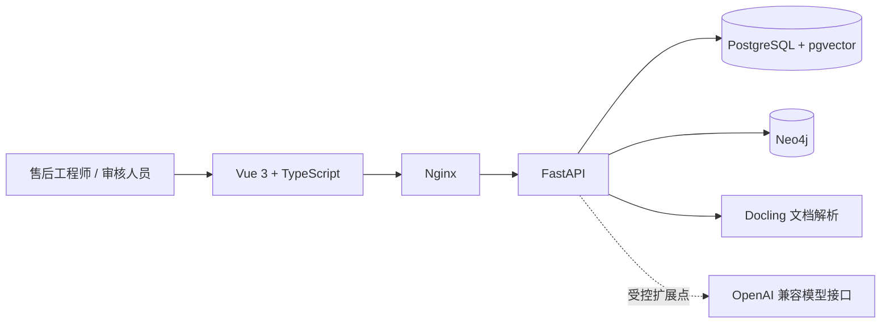

# 机床售后技术支持工作台

面向单家数控机床制造企业售后与技术支持团队的知识协同和故障辅助参考实现。系统把产品资料、报警知识、备件核对、维修案例、受控文档和多轮排查状态放进同一个可审计工作台。

> 本项目提供有出处的辅助信息，不控制机床、不自动修改参数、不绕过安全互锁，也不替代授权工程师和企业受控维修规程。

## 为什么不是普通问答机器人

- 只检索已发布知识，保留来源、版本、适用机型和数据分类。
- 使用结构化维修会话保存机型、序列号、报警、现场反馈和已完成检查。
- 后续只输入“还是不行，下一步呢”时，会继承当前故障并跳过已确认完成的步骤。
- Neo4j 关系路径参与检索限定，而不是只做可视化展示。
- 资料必须经过“上传—解析—候选提取—人工审核—发布”才能进入正式问答。
- 信息不足或依据不可靠时明确拒答，高风险操作始终要求工程师确认。

## 功能范围

| 模块 | 能力 |
| --- | --- |
| 产品主数据 | 产品系列、机型、公开参数和来源追溯 |
| 故障辅助 | 报警匹配、多轮上下文、检查进度、停止条件和相似案例 |
| 知识图谱 | 机型—子系统—报警—备件/案例的固定参数化查询 |
| 文档中心 | PDF、Office、图片和文本解析，版本及适用机型管理 |
| 知识治理 | 候选知识审核、发布、驳回、废止和数据边界标识 |
| 安全治理 | 角色权限、会话隔离、操作审计、拒答与人工确认 |
| 账号安全 | 失败登录持久化锁定、管理员解锁/停用、旧令牌即时失效 |

## 技术架构



- Vue 3、TypeScript、Pinia、Vite
- FastAPI、SQLAlchemy、Alembic
- PostgreSQL 16、pgvector
- Neo4j Community
- Docling
- Nginx、Docker Compose

大模型接口目前是关闭的受控占位符，核心流程由结构化数据、规则、多轮状态、文档检索和知识图谱完成。接入外部模型前必须单独评估数据出境、提示词注入和输出审核。

## 快速启动

要求：Docker Desktop 或 Docker Engine + Compose。

```bash
cp .env.example .env
```

编辑 `.env`，替换所有 `REPLACE_` 开头的值。可以使用下面的命令分别生成随机密钥：

```bash
python -c "import secrets; print(secrets.token_urlsafe(48))"
```

数据库密码应使用 URL 安全字符。然后启动：

```bash
docker compose up --build -d
```

打开 `http://localhost:8080`，使用 `.env` 中配置的管理员账号登录。若端口被占用，可修改 `WEB_PORT`。API 容器启动前会自动执行 `alembic upgrade head`。

`SEED_DEMO_DATA=false` 是生产安全默认值，只创建首个管理员，不写入演示产品、报警、备件或案例。需要体验下方演示流程时，可在隔离环境中显式改为 `SEED_DEMO_DATA=true`，体验结束后不要把演示数据当作企业知识使用。

## 推荐演示流程

1. 选择 `VMC1000II` 并填写演示序列号。
2. 提问：`出现 ATC-1001，自动换刀中止，先检查什么？`
3. 继续输入：`第二步已完成，气源压力显示正常，但还是不行，下一步呢？`
4. 观察当前维修会话、已完成检查、来源引用和知识图谱路径。
5. 输入新的报警或点击“新故障会话”，确认旧故障状态不会串线。

## 本地开发与测试

后端：

```bash
cd backend
python -m pip install -r requirements-dev.txt
alembic upgrade head
pytest -q
```

前端：

```bash
cd frontend
npm ci
npm run typecheck
npm run build
npm run dev
```

当前回归测试覆盖登录与权限、持久化登录锁定、账号停用与解锁、请求追踪、就绪检查、知识发布、拒答、图谱降级、文档处理、多轮上下文、故障切换、进度清空和密码失效，共 23 项。GitHub Actions 会自动执行后端测试、迁移、前端类型检查、生产构建和 Compose 配置检查。

## 演示数据与可信边界

产品目录来源于厂商公开页面，用于验证多型号、版本和来源追溯：

- [海天精工 VMC II 系列](https://haitianprecision.com/cn/products/vertical-2/vertical/)
- [海天精工立式加工中心公开产品目录](https://haitianprecision.com/wp-content/uploads/2020/06/VMC_GU_2020.5.pdf)
- [海天精工 VMC1000II](https://eu.haitianprecision.com/cn/%E4%BA%A7%E5%93%81/%E7%AB%8B%E5%BC%8F%E5%8A%A0%E5%B7%A5%E4%B8%AD%E5%BF%83/vmc-ii/vmc1000ii/)
- [海天精工 VMC1200II](https://eu.haitianprecision.com/products/vertical-machining-center/vmcll/vmc1200ii/)
- [海天精工 V8H](https://eu.haitianprecision.com/products/vertical-machining-center/v-series/v8h/)

公开资料没有提供可直接用于真实处置的完整报警、备件和维修工单，因此相关种子数据均标记为 `demo_process_data`。它们不是制造商维修指令，上线前必须替换为企业受控资料并完成人工审核。

## 目录结构

```text
.github/       CI、依赖更新和 Pull Request 模板
backend/       FastAPI、数据模型、Alembic、检索、图谱和测试
frontend/      Vue 3 + TypeScript 工作台
docs/          架构、验收清单和项目复审记录
data/uploads/  私有资料挂载目录，仅保留 .gitkeep
```

详细设计见 [架构与业务流程](docs/ARCHITECTURE.md)，当前企业适用程度见 [企业就绪度评估](docs/ENTERPRISE_READINESS.md)，部署前检查见 [首版验收清单](docs/ACCEPTANCE.md)，安全问题提交方式见 [SECURITY.md](SECURITY.md)。

## 已知边界

- 当前种子报警、备件和案例是明确标记的演示流程数据。
- 文档解析仍在 API 进程中同步执行，大批量导入需要持久化后台任务。
- 尚未实现 SSO/MFA、恶意文件扫描、不可篡改审计、异地备份和真实容量压测。
- 不提供多租户、双活、实时设备采集、远程控制或自动参数修改。

## 许可

当前仓库按“公开展示、保留权利”方式提供，详见 [LICENSE](LICENSE)。如需采用 MIT、Apache-2.0 或商业授权，应由仓库所有者在发布前明确选择。
